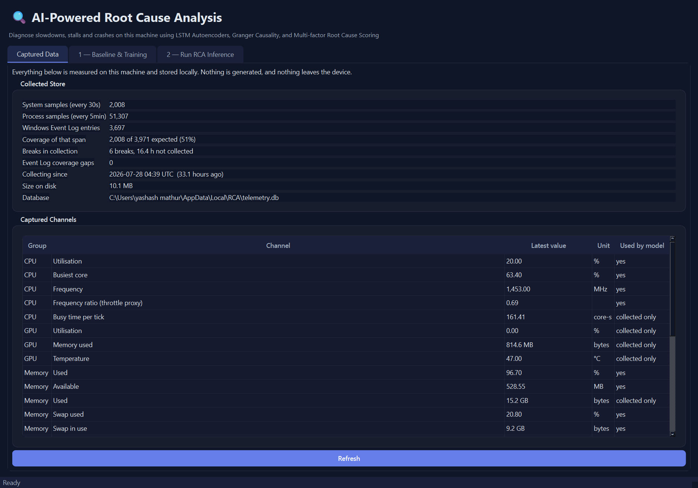
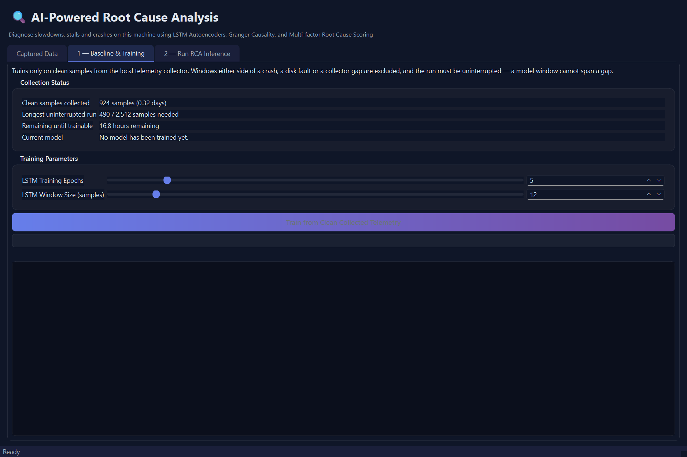
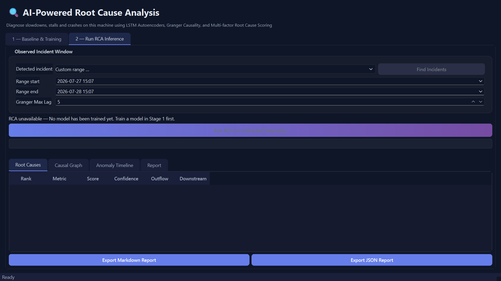

<p align="center">
  
  
  
  
</p>

<p align="center">
  
</p>

<h1 align="center">Local Root Cause Analysis</h1>

<p align="center">
  <b>Finds out why your laptop slowed down, stalled or crashed — from telemetry it collected itself.</b>
</p>

---

## What this is

When a machine gets slow, working out why means manually lining up resource
graphs against the Windows Event Log and guessing. This tool does that
automatically.

A background collector records what the machine is actually doing. An LSTM
autoencoder learns what normal looks like *for this machine*. When something
goes wrong, Granger causality builds a chain of what led to what, and
per-process samples name the program responsible.

**No synthetic data anywhere.** Every number the model sees was measured on the
machine it runs on. That is verifiable with two greps — see [Testing](#testing).

<p align="center">
  
</p>

---

## How it works

```
┌───────────────┐      ┌──────────────┐      ┌─────────────────────┐
│  collector    │─────▶│ telemetry.db │◀─────│  desktop app        │
│  headless     │      │   SQLite     │      │  train / analyse    │
└───────────────┘      └──────────────┘      └─────────────────────┘
   psutil      30s          WAL                  PySide6 (Qt 6)
   processes  5min
   Event Log  5min
```

The collector never calls the detector. The app is only a reader, which is why
an always-on monitoring mode can be added later without changing how data is
produced.

### The analysis pipeline

| Stage | What happens |
|---|---|
| **Baseline** | Windows around crashes, disk faults and collector gaps are excluded. A model window may never span a gap. |
| **Detection** | LSTM autoencoder; reconstruction error past the 99th percentile flags an anomaly. |
| **Incidents** | Discovered, not supplied — from runs of anomalous samples, or from an Event Log fault. |
| **Causality** | Granger tests, corrected with Benjamini–Hochberg FDR plus a 5% effect-size floor. |
| **Topology** | Edges pruned to physically plausible subsystem pairs, so `net_recv_bps → mem_pct` cannot be inferred. |
| **Ranking** | Multi-factor scoring: causal outflow, temporal priority, inflow, severity, PageRank. |
| **Attribution** | Per-process deltas name the program that consumed the resource. |

### Why the guardrails matter

A 35-minute incident is ~70 samples. Eight metrics at lag 5 means 280 Granger
tests, so roughly 14 edges pass `p<0.05` by chance alone — and they then feed a
ranker whose dominant term is out-degree. Hence the FDR correction, the
effect-size floor and the minimum sample count. **When nothing survives, the
report says "no supported causal chain" and makes no causal claim.**

---

## Quick start

### Install the Windows release (recommended)

1. Open the repository's [Releases page](https://github.com/mathuryashash/RCA-Major_project/releases).
2. Download `LocalRCA-vX.Y.Z-windows-x64.zip` and extract the entire ZIP to a folder you can write to, such as `C:\LocalRCA`.
3. Run `RCA-Desktop\RCA-Desktop.exe`. On first launch it shows exactly what
   will be recorded and asks whether to begin. Nothing is collected until you
   agree.
4. To keep collecting while the app is closed, install the background
   collector. Open PowerShell in the extracted folder and run:

   ```powershell
   .\RCA-Collector\RCA-Collector.exe install
   .\RCA-Collector\RCA-Collector.exe status
   ```

   This registers a per-user startup entry — no administrator rights needed —
   and lists the app in Add/Remove Programs.

Prefer the command line for the whole flow? `accept-consent` does in one step
what the first-run dialog does:

```powershell
.\RCA-Collector\RCA-Collector.exe accept-consent
.\RCA-Collector\RCA-Collector.exe install
```

### Uninstalling

Either remove **LocalRCA** from Windows Settings → Apps → Installed apps, or:

```powershell
.\RCA-Collector\RCA-Collector.exe uninstall
```

Both stop collection and remove the startup entry. **Your collected data is
deliberately left in place** — removing the autostart entry should not throw
away a trained model without being asked. To erase it too, run
`delete-all-data` (below), then delete the extracted folder.

Do **not** move either EXE out of its folder: the adjacent `_internal` directory
contains required runtime files. Windows may show a SmartScreen prompt for an
unsigned academic build; verify the release is published from this repository
before choosing to run it.

To stop collection and erase all local data, run
`.\RCA-Collector\RCA-Collector.exe delete-all-data` from the extracted folder.
This erases the whole data directory — not only the collected telemetry, but
the **trained model and every generated report** — and removes the startup
entry, so collection does not resume at the next logon until you run `install`
again. Retraining needs a fresh baseline, which takes about 21 hours of
collection.

Collection is stopped and the startup entry removed *before* the data is
erased. So if the collector does not release the database within 35 seconds,
the command reports `Collector is still running`, exits non-zero, and leaves
your data intact — but collection is already stopped and autostart already
gone. Re-run it to finish erasing, or run `install` again to resume.

### Install from source

```bash
git clone https://github.com/mathuryashash/RCA-Major_project.git
cd RCA-Major_project
pip install -r requirements.txt
```

### 1. Start collecting

```bash
cd src
python -m telemetry accept-consent   # states exactly what is recorded
python -m telemetry install          # runs at every logon
python -m telemetry status           # consent, schedule, samples so far
```

Training needs **2,512 uninterrupted clean samples** — about 21 hours at the
30-second cadence. `status` reports progress, and the app shows hours remaining.

### 2. Train and analyse

```bash
python -m desktop.main
```

**Captured Data** shows what is being recorded and how much. **Stage 1** trains
once enough clean history exists. **Stage 2** lists detected incidents, or takes
a custom time range, and produces a ranked report.

<p align="center">
  
  
</p>

### Build a standalone executable

```powershell
.\packaging\build.ps1     # → dist\RCA-Desktop\ and dist\RCA-Collector\
```

---

## What gets collected

| Group | Channels |
|---|---|
| CPU | utilisation, busiest core, frequency, frequency ratio (throttle proxy), busy time |
| GPU | utilisation, memory used, **temperature** (via NVML) |
| Memory | used %, available, swap %, swap in use, swap change |
| Disk | read/write rate, busy %, free space |
| Network | sent, received |
| Load | process count |
| Power | charge, drain rate, on mains |
| Context | idle time, foreground executable |
| Processes | top 15 by CPU ∪ top 15 by RSS, every 5 min |
| Events | Kernel-Power 41, app crashes and hangs, disk faults, WHEA, resource exhaustion, Windows Update, MSI installs |

The GPU is the only temperature source — `psutil.sensors_temperatures()`
returns nothing on Windows. Channels are collected before they are modelled:
adding a new one straight to the feature set would discard every sample
recorded before it existed.

---

## Privacy

Everything stays on the machine. The collector opens no sockets.

- **Window titles are never captured** — only the foreground executable name.
  Titles leak document names, URLs and message contents.
- **Event message text is not stored** unless you pass `--capture-messages`.
  Provider, ID, level and time carry everything the analysis needs.
- With opt-in, messages are redacted for user paths on any drive, UNC paths,
  URLs, email addresses and your username — best-effort, and the dialog says so.
- `python -m telemetry delete-all-data` stops collection, removes the startup
  entry, and erases the entire data directory: the database, the trained model,
  every generated report, and the collector log — which records exception
  tracebacks containing your profile path. It also clears the rendered charts
  the desktop app leaves in your temp directory, which hold the metric values
  behind an incident.
- Reports you export yourself are not tracked and not deleted: they go where
  you choose to save them.

Exported reports contain process names, so they are the one thing that leaves
the machine if you share them.

---

## Measured cost

Measured on the development machine (20 logical cores, RTX 4060 Laptop).

| | | |
|---|---|---|
| Collector memory | 20–30 MB | measured, live process |
| Collector CPU | 0.36% of one core | measured |
| Model size | 129k parameters (0.52 MB) | measured |
| Training | ~24 s | benchmark at 1,716 windows × 25 features |
| Desktop app | 455 MB | measured; QtWebEngine dominates |
| Packaged build | 1.5 GB | measured; torch is 628 MB of it |

**No GPU is used for training.** The model is 0.52 MB, and a 60-step LSTM at
hidden=64 is kernel-launch bound — a GPU sits idle between launches, while the
CUDA wheel would add an estimated ~2 GB to an already 1.5 GB build. Capping
torch threads at 4 instead of the all-cores default made training **3.9×
faster**, which is a larger win than a GPU could deliver here.

---

## Project structure

```
src/
├── telemetry/           # collection: no analysis, no ML
│   ├── collector.py     #   loop, burst sampling, consent gate
│   ├── sampler.py       #   psutil + NVML snapshots
│   ├── eventlog.py      #   Event Log, per-channel watermark
│   ├── store.py         #   SQLite schema and migrations
│   ├── analysis.py      #   baseline selection, gaps, incidents
│   └── schedule.py      #   autostart registration
├── models/              # LSTM autoencoder
├── anomaly_detection/   # active ensemble detector
├── causal_inference/    # Granger-based causal engine and topology prior
├── reporting/           # RCA report generation
├── pipeline/            # shared GUI-agnostic engine
└── desktop/             # PySide6 application
```

---

## Testing

```bash
python -m pytest tests/ -q     # 69 tests
```

Tests use recorded data and live system calls, never generated telemetry. The
no-synthetic-data guarantee is checkable — both of these must return nothing:

```bash
grep -rn "SyntheticMetricsGenerator\|generate_data\|inject_failure" src/
grep -rn "np\.random\|torch\.randn" src/
```

---

## Limitations

- **Windows only.** Event Log ingestion and idle/foreground detection use Win32 APIs.
- **Needs ~21 hours of uninterrupted collection** before the first model.
- **Single machine.** No fleet or cross-host analysis.
- **Slow drift is out of scope.** A disk filling over weeks, or a memory leak
  with a rising floor, needs a trend detector; acute resource exhaustion is handled.
- **Causal claims are statistical**, constrained by a hand-specified topology.
  Reports state how much evidence survived correction rather than implying a
  verified answer.

---

## Design documents

- [Design spec](docs/superpowers/specs/2026-07-27-real-telemetry-rca-design.md) — architecture and the reasoning behind each decision
- [Repository overview](docs/Repository_Overview.md)
- [UI overview](docs/UI_overview.md)

<p align="center">
  <sub>Built with PyTorch, PySide6, and causal inference.</sub>
</p>
